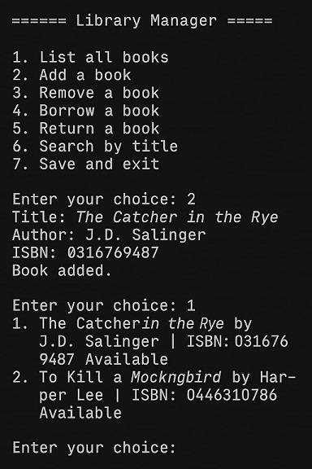

# python-library-manager-OOP

## Project Purpose

FR : Ce projet a été conçu dans le but de démontrer mes compétences en programmation orientée objet (OOP) avec Python. Il complète mes connaissances techniques par une mise en pratique concrète, dans un format structuré et maintenable, en suivant les bonnes pratiques actuellement recherchées par les recruteurs.

À travers ce gestionnaire de bibliothèque en ligne de commande (CLI), j’ai voulu illustrer ma capacité à :

Concevoir une architecture orientée objets claire

Implémenter une logique métier testable et modulaire

Manipuler des fichiers (JSON), gérer des erreurs et intégrer des tests unitaires

Ce projet s’inscrit dans une démarche d’apprentissage continu, visant à aligner mes compétences sur les attentes actuelles du marché du développement logiciel.


EN : This project was created to showcase my skills in object-oriented programming (OOP) with Python. It complements my technical background with a concrete, well-structured implementation that aligns with current industry standards and expectations from recruiters.

Through this command-line library manager, I aimed to demonstrate my ability to:

Design clean and modular OOP architecture

Implement business logic that is testable and maintainable

Handle file operations (JSON), error management, and unit testing

This project is part of a continuous learning approach to align my expertise with the current demands of the software development job market.





## Project Structure

```bash
python-library-manager-OOP/
│
├── README.md
├── main.py
├── book.py
├── user.py
├── member.py
├── librarian.py
├── library.py
├── exceptions.py
├── data/
│   └── books.json
├── tests/
│   └── test_library.py
├── requirements.txt
└── .gitignore
```

## Library Manager CLI

A simple command-line application written in Python to manage a small library system using object-oriented programming (OOP) principles.

### Features

- Add, remove, and search for books
- Manage members and librarians
- Borrow and return books
- Save and load data (JSON format)
- Command-line menu interface
- Unit tests included

### Technologies

- Python 3.x
- JSON for data persistence
- unittest for testing

### Getting Started

#### Clone the repository
```bash
git clone https://github.com/Heliote225/python-library-manager-OOP.git
```
```bash
cd python-library-manager-OOP
```
#### Install dependencies (if any)

```bash
pip install -r requirements.txt
```

#### Run the app

```bash
python main.py
```

#### Run tests

```bash
python -m unittest discover tests
```

## Project Structure

```bash
book.py: Defines the Book class

user.py, member.py, librarian.py: User classes with OOP hierarchy

library.py: Core class to manage the library logic

main.py: CLI interaction logic

data/: Stores saved books in JSON format

tests/: Unit tests for the application
```

## Contributing
Pull requests are welcome. For major changes, open an issue first to discuss what you would like to change.

## License
Open Source
